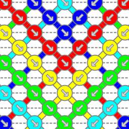

# Bracelet Editor

This is an attempt to create an editor for friendship bracelets
as the mayor sites for friendship bracelets already have.
The goal is to create an editor that is knot-color based and
the "best" path for the threads is automaticaly detected. This
is one feature the site-editors do not have.

May be the algorithm to find the "best" paths will be plugable, so
some special threatment (like "straight edge" or "1212") are taken
into account.

Any contribution to this project is welcome.
